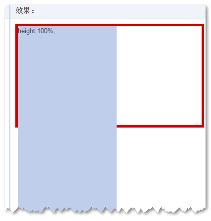
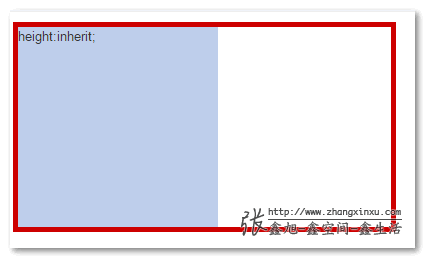

[原文链接](http://www.zhangxinxu.com/wordpress/?p=4642)

CSS如下：

    .outer {
        display: inline-block;
        height: 200px; width: 40%;
        border: 5px solid #cd0000;
    }
    .height-100 {
        position: absolute;
        height: 100%; width: 200px;
        background-color: #beceeb;
    }
    .height-inherit {
        position: absolute;
        height: inherit; width: 200px;
        background-color: #beceeb;
    }

HTML如下：

    

    

结果，`height:100%`的冲破云霄，哦，不对，是深入~~地域~~地狱：

而`height:inherit`却完美高度自适应没有定位特性的父级元素：

对绝对定位有所了解的应该都知道原因，我就不解释了。

总之，这里，`height:inherit`的强大好用可见一斑。回头，容器高度变化了，里面的绝对定位元素依然高度自适应。这是很赞的特性，因为如果页面很复杂，避免使用`position: relative`会让你少去很多`z-index`混乱层级覆盖的麻烦。