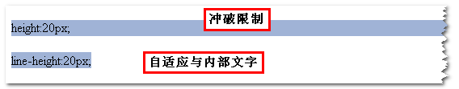

上图中第一个标签使用height定高，结果宽度直接100%显示；第二个标签使用line-height定高，结果很规矩，自适应与内部文字大小。其代码如下：

css部分：

    .out{display:inline-block; background:#a0b3d6; margin-top:20px;}
    .in1{display:block; height:20px;}
    .in2{display:block; line-height:20px;}

html部分：

    
        height:20px;
    
    
        line-height:20px;
    

[链接🔗](http://www.zhangxinxu.com/wordpress/2009/11/css%E8%A1%8C%E9%AB%98line-height%E7%9A%84%E4%B8%80%E4%BA%9B%E6%B7%B1%E5%85%A5%E7%90%86%E8%A7%A3%E5%8F%8A%E5%BA%94%E7%94%A8/)