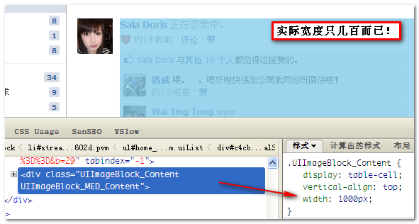

1、左侧固定宽度-左浮动 右侧绝对定位
-------------------

```css
 .left {
   width: 400px;
   float: left;
 }
 .right {
   position: absolute;
   padding-left: 400px;
 }
```

2、左侧固定宽度 
 右侧绝对定 通过left top 等定位
-------------------------------

```css
.left {
  width: 400px;
}
.right {
  position: absolute;
  top: 0;
  left: 400px;
}
```

3、左侧浮动 右侧table-cell
-------------------

```css
.left {
  width: 400px;
}
.right {
  display: table-cell;
  width: 9999px;
}
```

[链接](http://www.zhangxinxu.com/wordpress/2010/10/%E9%A1%B5%E9%9D%A2%E9%87%8D%E6%9E%84%E2%80%9C%E9%91%AB%E4%B8%89%E6%97%A0%E5%87%86%E5%88%99%E2%80%9D-%E4%B9%8B%E2%80%9C%E6%97%A0%E5%AE%BD%E5%BA%A6%E2%80%9D%E5%87%86%E5%88%99/)

其它方法
----

### 4、flex布局

`​`​ html代码

```html
<div class="content">
  <div class="left"></div>
  <div class="right"></div>
</div>
```

css代码

```css
.content {
  display:flex;
}
.left {
  width: 400px;
}
.right {
  flex-grow: 1;
}
```