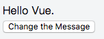
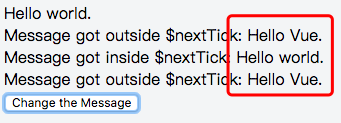

* `Vue.nextTick(callback)`，当数据发生变化，更新后执行回调。
* `Vue.$nextTick(callback)`，当dom发生变化，更新后执行的回调。

## 模板——
```html
<div class="app">
  <div ref="msgDiv">{{msg}}</div>
  <div v-if="msg1">Message got outside $nextTick: {{msg1}}</div>
  <div v-if="msg2">Message got inside $nextTick: {{msg2}}</div>
  <div v-if="msg3">Message got outside $nextTick: {{msg3}}</div>
  <button @click="changeMsg">
    Change the Message
  </button>
</div>
```
## Vue 实例化——
```javascript
new Vue({
  el: '.app',
  data: {
    msg: 'Hello Vue.',
    msg1: '',
    msg2: '',
    msg3: ''
  },
  methods: {
    changeMsg() {
      this.msg = "Hello world."
      this.msg1 = this.$refs.msgDiv.innerHTML
      this.$nextTick(() => {
        this.msg2 = this.$refs.msgDiv.innerHTML
      })
      this.msg3 = this.$refs.msgDiv.innerHTML
    }
  }
})
```

点击按钮前的界面

点击按钮之后，界面如下，注意观察三个条件渲染的结果之间的差异。

> 看完这个示例，也许有人会问，我在 Vue 实例方法中修改了数据，然后再在 $nextTick 回调中获取该数据在相应 DOM 元素所绑定的内容（或属性）殊无必要，我为什么需要这样的 API 呢？

> 考虑这样一种场景，你有一个 jQuery 插件，希望在 DOM 元素中某些属性发生变化之后重新应用该插件，这时候就需要在 $nextTick 的回调函数中执行重新应用插件的方法。